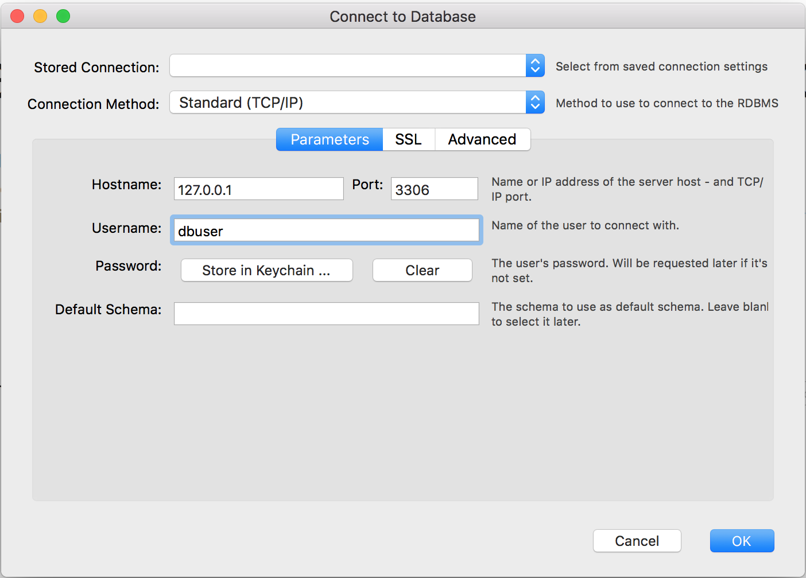

# Using a Database

## Setting up mySQL

```bash
brew install mysql
mysql.server start
mysql_secure_installation
```

When asked to enable **VALIDATE PASSWORD** component answer 'y' then '0' since we are just installing locally then provide your password. 'y' On removing anonymous users, 'y' on disabling root login remotely, 'y' on removing the test database, then lastly 'y' on reloading privilege tables.

```bash
mysql -uroot -p
Enter password:
Welcome to the MySQL monitor.  Commands end with ; or \g.
Your MySQL connection id is 10
Server version: 8.0.12 Homebrew

Copyright (c) 2000, 2018, Oracle and/or its affiliates. All rights reserved.

Oracle is a registered trademark of Oracle Corporation and/or its
affiliates. Other names may be trademarks of their respective
owners.

Type 'help;' or '\h' for help. Type '\c' to clear the current input statement.

mysql> create database training;
Query OK, 1 row affected (0.02 sec)

mysql> CREATE USER 'dbuser'@'localhost' IDENTIFIED WITH mysql_native_password BY 'p455w0rd_';
Query OK, 0 rows affected (0.03 sec)

mysql> grant all on training.* to 'dbuser'@'localhost';
Query OK, 0 rows affected (0.08 sec)
```

Then re-login using the user that we have created:

```bash
mysql -udbuser -p
Enter password:
Welcome to the MySQL monitor.  Commands end with ; or \g.
Your MySQL connection id is 12
Server version: 8.0.12 Homebrew

Copyright (c) 2000, 2018, Oracle and/or its affiliates. All rights reserved.

Oracle is a registered trademark of Oracle Corporation and/or its
affiliates. Other names may be trademarks of their respective
owners.

Type 'help;' or '\h' for help. Type '\c' to clear the current input statement.

mysql> show databases;
+--------------------+
| Database           |
+--------------------+
| information_schema |
| training           |
+--------------------+
2 rows in set (0.01 sec)

mysql>
```

Exit mySQL then go to the src/database folder import the sample data into the newly created database:

```bash
mysql -udbuser -p < training.sql
```

For this training we will use MySQL Workbench for easier access to MySQL. Go to this link: https://dev.mysql.com/downloads/workbench/

Once you get MySQL Workbench to run, go to **Database > Connect to Database** and configure it with the MySQL user that we have created:



We will be using the **node-mysql2** (https://github.com/sidorares/node-mysql2) library.

For this session please refer to **src/database** for the sample snippets.

## Using an ORM

On some cases, it might be easier to make queries using an ORM. Using an ORM automatically converts the data received from response into Javascript objects that is easier to work with.

For this tutorial we will be using **sequelize** (https://github.com/sequelize/sequelize) as our ORM. 

For this tutorial please refer to **src/orm** for the sample snippets.

On cases where the database is already existing, you may use **sequelize-auto** (https://github.com/sequelize/sequelize-auto) in order to automatically generate models:

```bash
npm install -g sequelize-auto
npm install -g mysql
sequelize-auto -o "./models" -d training -h localhost -u dbuser -p 3306 -x p455w0rd_ -e mysql
```

