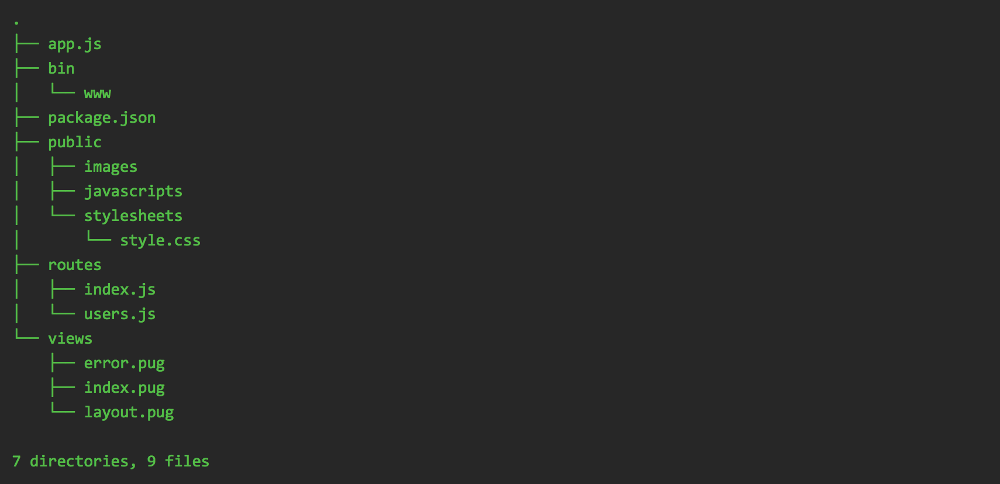

# Writing your own API Server

On some cases where **json-server** is not flexible enough to make a mock server. You may also implement a quick API server on your own

## express

express (https://expressjs.com) is one of the oldest and most mature web frameworks in node.js. For this tutorial, we will be using express to create a API server. To install:

```bash
npm install --save express
```

## Creating a quick API server

Create a new file called **hello.js** with this following contents:

```javascript
let express = require('express')
let app = express()

app.get('/', function (req, res) {
    res.json({"message": "Hello, world!"});
});

app.listen(3000, function () { console.log("API Server listening on port 3000") });
```

Save and then run:

```bash
node hello.js
```

Your server should be accessible from http://localhost:3000/

## Express Generator

The example above is a very simple demonstration of express. In order for you to create a full fledged API server project, you would need organization and a lot of scaffolding. In order to fast track this, express has a helper utility called **express-generator** (https://github.com/expressjs/generator). To install:

```bash
npm install -g express-generator
```

Now we can create a new expressjs project by running:

```bash
express training
cd training
npm install
npm start
```

It will create a boilerplate code with default routes for **/** and **/users**. It will also create a organized directory structure for your project:



## Tying it all together

For this exercise, we will run through **src/api** folder. This is an implementation of an API server that implements all you have learned throughout this training.

The API Server uses the following:

- **express** - as the web framework
- **sequelize** - as the data access layer
- **mysql** - as the database backend

